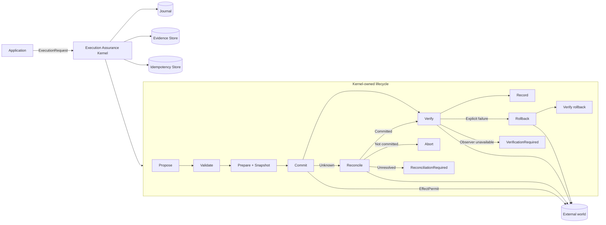
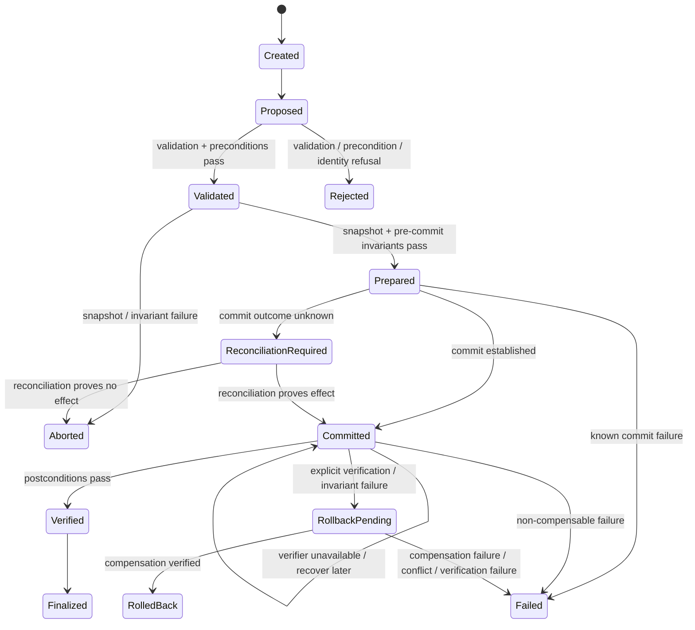

<div align="center">

# Execution Assurance Microkernel

**A compact Rust reference microkernel for making externally visible side effects verifiable, recoverable, and auditable.**

> **Commit is not success. Success is an established commit plus independently verified postconditions.**

[](https://github.com/SaridakisStamatisChristos/Execution-Assurance-Microkernel/actions/workflows/ci.yml)
[](LICENSE)
[](Cargo.toml)
[](Cargo.toml)
[](#scope-and-non-goals)

[Why it exists](#why-it-exists) · [Architecture](#architecture) · [Guarantees](#kernel-invariants-k1k10) · [Quick start](#quick-start) · [Recovery](#crash-recovery) · [Benchmarks](#benchmarks) · [License](#license)

</div>

---

## Why it exists

Software routinely treats a successful function return, database call, or HTTP response as proof that an operation succeeded. That breaks at exactly the boundaries where reliability matters most:

- a remote side may apply an effect while the response is lost;
- a process may crash between the external effect and local bookkeeping;
- a commit may return successfully while the intended postcondition is absent;
- a verifier may itself be unavailable, making the result **unknown rather than false**;
- rollback may fail, partially restore state, or become unsafe after another actor changes the world;
- an interrupted local append may leave a torn final persistence frame;
- retry after an unknown outcome may duplicate a real-world effect.

Execution Assurance Microkernel isolates that problem into one small lifecycle:

```text
PROPOSE -> VALIDATE -> PREPARE -> COMMIT -> VERIFY -> RECORD
                                      |         |
                                      |         +-- explicit failure --> ROLLBACK -> VERIFY ROLLBACK
                                      |         +-- observer error ----> VERIFY LATER (no rollback)
                                      +-- unknown --> RECONCILE (never blind retry)
```

The kernel does **not** decide what action should be taken. Application code proposes the action. The kernel owns the execution boundary: whether the effect may occur, whether it can be established, whether the intended result is actually observed, how interrupted execution is recovered, and what evidence remains afterward.

## At a glance

| Property | Implementation |
|---|---|
| Language | Rust 2021 |
| MSRV | Rust 1.89 |
| Unsafe Rust | Forbidden at crate level |
| Core success rule | established commit **and** verified postcondition |
| Unknown commit | reconciliation; never blind retry |
| Unknown verification | `VerificationRequired`; never automatic rollback |
| Rollback | snapshot-based, independently verified |
| Compensation conflict | explicit `RollbackStatus::Conflict` |
| Crash recovery | fsync-backed journal + recovery envelope |
| Torn JSONL tail | repaired on reopen; committed corruption fails closed |
| Execution identity | explicit execution ID + idempotency key |
| Durable local deduplication | atomic, fsync-backed claim files |
| Evidence | machine-readable execution record + SHA-256 seal |
| Secret handling | configurable + label-based diagnostic redaction |
| Fault testing | 8 lifecycle injection points + property/model tests |
| Reference actions | atomic file, SQLite, adversarial remote API |
| License | Apache-2.0 |

## Architecture



`commit`, `rollback`, and `reconcile` require an `EffectPermit`. Downstream `Action` implementations can name that type but safe downstream code cannot construct it, so the normal effect boundary is enforced structurally rather than by convention.

## Execution state machine



`ReconciliationRequired` is deliberately nonterminal. Verification uncertainty is represented by a nonterminal evidence checkpoint while the durable head remains `Committed`.

## Kernel invariants K1–K10

The project treats these as executable design constraints rather than documentation-only aspirations.

| ID | Invariant | Meaning |
|---|---|---|
| **K1** | `commit -> validation_passed` | no unchecked effect crosses the commit boundary |
| **K2** | `success -> commit_established && postconditions_verified` | commit alone is not success |
| **K3** | `verification_failed -> outcome != success` | a negative readback can never report success |
| **K4** | `same_key -> commit_count <= 1` | duplicate logical requests do not create another local effect |
| **K5** | `terminal_state -> evidence_record_exists` | durable terminal state follows durable evidence |
| **K6** | `rollback_success -> rollback_postconditions_verified` | compensation must itself be proven |
| **K7** | `commit_unknown -> reconciliation_before_retry` | unknown commit outcomes are never blindly retried |
| **K8** | `verification_indeterminate -> no rollback` | observer failure is uncertainty, not proof of a bad postcondition |
| **K9** | `torn_tail -> prior_frames_readable` | an interrupted final append cannot invalidate earlier committed history |
| **K10** | `ownership_lost -> compensation_conflict` | detectable interference is exposed instead of silently overwritten |

Duplicate **execution IDs** additionally fail closed before lifecycle execution begins.

K10 is action-specific rather than a claim of distributed fencing. The SQLite reference action has an atomic compare-condition in its rollback update. The file reference action compares current content before restoration, which catches ordinary interference but cannot turn a general filesystem into a compare-and-swap service.

## Core API

```rust
let result = Kernel::default().execute(action, &mut context)?;
```

For stable execution identity and local deduplication:

```rust
use execution_assurance_microkernel::{ExecutionRequest, IdempotencyKey};

let request = ExecutionRequest::new(action)
    .with_execution_id("job-42")
    .with_idempotency_key(IdempotencyKey::from("request-42"));

let result = kernel.execute_request(request, &mut context)?;
```

For restart recovery:

```rust
let result = kernel.recover("job-42", action, &mut context)?;
```

Application code implements `Action`; the kernel owns sequencing, durability boundaries, reconciliation, verification, compensation semantics, evidence persistence, and terminal-state ordering.

## Quick start

Requirements: Rust **1.89+** and Cargo.

```bash
git clone https://github.com/SaridakisStamatisChristos/Execution-Assurance-Microkernel.git
cd Execution-Assurance-Microkernel

cargo fmt --all -- --check
cargo clippy --locked --all-targets --all-features -- -D warnings
cargo test --locked --all-targets --all-features
cargo test --locked --doc --all-features
RUSTDOCFLAGS="-D warnings" cargo doc --locked --no-deps
cargo bench --locked --no-run
```

Reference actions:

```bash
cargo run --example atomic_file
cargo run --example sqlite
cargo run --example unreliable_api
```

## Commit, verification, and compensation

### Commit is only an observation

`Action::commit` returns:

```text
Confirmed(output)
Failed(error)
Unknown(reason)
```

`Confirmed` establishes the commit boundary's report. The kernel still requires an independently verified postcondition before returning `ExecutionOutcome::Success`.

### Verification is tri-state in meaning

The existing `Result<Vec<CheckRecord>, Error>` contract is interpreted deliberately:

```text
Ok(all checks pass)  -> VERIFIED
Ok(any check fails)  -> explicit verification failure
Err(observer error)  -> VerificationRequired
```

An observer error is not evidence that the postcondition is false. The kernel records schema-version-3 evidence with `VerificationRecord.indeterminate = true`, keeps the durable head at `Committed`, returns `ExecutionOutcome::VerificationRequired`, and performs **no compensation**.

A later `recover(...)` re-establishes/readbacks the committed output and verifies again without repeating `commit`. Repeated observer failure remains recoverable. If a later observation explicitly disproves the postcondition, normal compensation policy applies.

### Compensation is explicit and conflict-aware

Actions declare `Compensable` or `NonCompensable` and expose a rollback result:

```text
RollbackStatus::Succeeded
RollbackStatus::Failed(error)
RollbackStatus::Conflict { reason }
```

Existing actions remain source-compatible through a default mapping from the original `rollback()` hook. Conflict-aware actions can override `rollback_status()` to refuse restoration when current state is no longer attributable to the execution being compensated.

`Succeeded` is still not enough: rollback postconditions and post-rollback invariants must independently pass before the outcome can be `RolledBack`.

## Unknown commit outcomes and reconciliation

The dangerous case is uncertainty:

```text
send request
remote system applies effect
response disappears
client sees timeout
```

The kernel enters `ReconciliationRequired` and uses action-specific readback:

| Reconciliation result | Kernel behavior |
|---|---|
| `Committed(output)` | continue to verification |
| `NotCommitted` | abort without re-running commit |
| `Unresolved(reason)` | remain recoverable and fail closed |

The kernel never blindly calls `commit` again because an outcome is unknown.

## Crash recovery

The durable sequence is intentionally explicit:

```text
WRITE PREPARED(snapshot + recovery envelope)
fsync

ATTEMPT EXTERNAL EFFECT

WRITE COMMITTED
fsync

VERIFY POSTCONDITION

WRITE VERIFIED
fsync

PERSIST SEALED EVIDENCE

WRITE TERMINAL STATE
fsync
```

A crash after the effect but before the `Committed` marker leaves durable `Prepared`, so recovery reconciles rather than recommitting.

### Recovery table

| Last durable state | Recovery action |
|---|---|
| `Created` / `Proposed` / `Validated` | abort before commit |
| `Prepared` | reconcile before any retry decision |
| `ReconciliationRequired` | reconcile again; never recommit |
| `Committed` | re-establish/read back output, then verify; compensate only after explicit failure |
| `RollbackPending` | verify whether compensation already completed; resume only if needed |
| `Verified` | finalize without repeating the effect |
| terminal state | no recovery action |

A prior `VerificationRequired` outcome maps naturally to the `Committed` recovery path.

### Torn-tail-safe local logs

`FileJournal` and `JsonlEvidenceStore` use newline-delimited frames:

```text
JSON bytes -> newline -> flush -> sync_data
```

The newline is the local frame-commit marker. On reopen, unterminated bytes after the last newline are treated as an interrupted, uncommitted tail and truncated. Earlier frames remain readable.

Malformed **newline-terminated** JSON is not repaired or skipped. It is treated as committed corruption and readers fail closed.

When a durable JSONL file is newly created, the file is synced and, on Unix, its parent directory is synced so the new directory entry is durable before subsequent frames are relied upon.

## Identity and idempotency

Two identities are intentionally separate:

- **Execution ID** — identity of this kernel execution.
- **Idempotency key** — identity of the logical request/effect.

Duplicate execution IDs fail closed. Duplicate idempotency keys do not silently cross the local effect boundary again. `FileIdempotencyStore` uses atomically created, fsync-backed claim files so local claims survive process restart.

This is a **local execution guarantee**, not a distributed exactly-once protocol. Remote exactly-once semantics still require stable remote identity, readback, native idempotency, or another appropriate protocol.

## Evidence model

Every execution emits a machine-inspectable `ExecutionRecord` containing identity, timestamps, transitions, validation, preconditions, invariants, commit disposition, reconciliation, verification, rollback, recovery metadata, typed failure, outcome, and a SHA-256 record seal.

Schema version 3 adds explicit verification indeterminacy so evidence can distinguish "observed false" from "could not observe."

### Terminal-state ordering

K5 is enforced by ordering:

```text
construct terminal transition in memory
-> redact evidence
-> seal ExecutionRecord
-> persist evidence
-> append terminal journal state + fsync
-> return ExecutionResult
```

If evidence persistence fails, the journal remains at a recoverable nonterminal head.

### Redaction

`ConservativeRedactor` removes explicitly configured secret values plus values following common sensitive labels including `password=`, `token=`, `secret=`, `api_key=`, and `authorization=` before sealing/persistence.

Recovery snapshots live in the journal rather than the evidence record and may contain sensitive application state. Storage protection remains the caller's responsibility.

## Failure taxonomy

The implementation distinguishes materially different failure semantics: validation, precondition, snapshot, known/unknown commit, explicit/indeterminate verification, invariant, rollback failure, compensation unavailable, compensation conflict, reconciliation, recovery, evidence persistence, journal, execution identity, idempotency, and injected faults.

That distinction matters because safe recovery depends on knowing **where uncertainty begins and whether state ownership still exists**.

## Fault injection and adversarial testing

The deterministic injector exposes all eight lifecycle boundaries:

| Fault point | Expected safe interpretation |
|---|---|
| `BeforeSnapshot` | no effect; abort before commit |
| `AfterSnapshot` | no effect; abort before commit |
| `BeforeCommit` | prepared; reconcile before retry |
| `DuringCommit` | prepared; effect uncertain; reconcile |
| `AfterCommit` | prepared; effect may exist; reconcile |
| `BeforeVerify` | committed; recover and verify |
| `DuringRollback` | rollback pending; resume/verify compensation |
| `AfterRollback` | rollback pending; verify whether rollback already completed |

Hardening regressions additionally cover:

- verifier unavailable after a successful commit;
- repeated verifier unavailability across recovery;
- later verification success without a second commit;
- later explicit failed verification followed by compensation;
- torn final journal and evidence records;
- committed malformed JSON failing closed;
- appending after torn-tail repair;
- explicit compensation conflict;
- SQLite concurrent-state preservation;
- atomic-file interference refusal.

The adversarial fake remote API separately models timeout-before-apply, lost-response-after-apply, duplicate request, partial write, conflicting remote state, and unresolved outcomes. Property/model tests explore combinations beyond hand-written cases.

## Reference actions

The repository intentionally contains **exactly three** reference actions.

| Example | What it demonstrates | Run |
|---|---|---|
| Atomic file replacement | snapshot, fsync, rename, hash verification, reconciliation, conflict-aware compensation | `cargo run --example atomic_file` |
| SQLite mutation | optimistic version precondition, persisted-state verification, reconciliation, atomic conditional compensation | `cargo run --example sqlite` |
| Unreliable remote API | timeout, duplicate request, lost response, partial write, uncertainty, reconciliation | `cargo run --example unreliable_api` |

The goal is depth of semantics, not integration count.

## Benchmarks

`benches/kernel.rs` measures:

```bash
cargo bench --locked --bench kernel
```

Reference run: GitHub Actions `ubuntu-24.04`, Rust stable 1.99.0, 2026-10-08.

| Path | Samples | Median | p95 |
|---|---:|---:|---:|
| core verified success | 512 | **7.013 µs** | **10.910 µs** |
| verification failure → verified rollback | 512 | **9.117 µs** | **15.729 µs** |
| durable verified success with fsync | 64 | **1.990 ms** | **2.522 ms** |

Criterion from the same run reported approximately `7.23–7.32 µs`, `9.45–9.65 µs`, and `2.29–2.42 ms` respectively.

[View the benchmark/validation run](https://github.com/SaridakisStamatisChristos/Execution-Assurance-Microkernel/actions/runs/37857640762)

These are environment-specific observations, **not universal latency guarantees**.

## Quality gates

Every CI run validates:

```text
rustfmt --check
Clippy -D warnings
all-target / all-feature tests
compile-fail doctests
rustdoc -D warnings
benchmark target compilation
Rust 1.89 MSRV
```

The workflow has read-only repository permissions.

## Repository layout

```text
.
├── src/
│   ├── action.rs          # Action contract, EffectPermit, RollbackStatus
│   ├── kernel.rs          # lifecycle orchestration and recovery execution
│   ├── state.rs           # explicit state machine
│   ├── invariant.rs       # preconditions and invariant phases
│   ├── durable_log.rs     # torn-tail-safe local JSONL opening/repair
│   ├── journal.rs         # in-memory + fsync-backed execution journal
│   ├── recovery.rs        # recovery classification/directives
│   ├── idempotency.rs     # in-memory + durable local claims
│   ├── evidence.rs        # records, stores, hashing, redaction
│   ├── fault.rs           # deterministic fault injection
│   └── error.rs           # typed failure taxonomy
├── examples/
│   ├── atomic_file.rs
│   ├── sqlite.rs
│   └── unreliable_api.rs
├── tests/
│   ├── lifecycle.rs
│   ├── verification_uncertainty.rs
│   ├── fault_injection.rs
│   ├── recovery.rs
│   ├── idempotency.rs
│   ├── model_based.rs
│   ├── evidence_integrity.rs
│   ├── assurance_boundaries.rs
│   └── durable_journal.rs
├── benches/kernel.rs
├── docs/
│   ├── SPEC.md
│   ├── STATE_MACHINE.md
│   └── FAILURE_MODEL.md
├── LICENSE
├── NOTICE
└── README.md
```

## Documentation

- [`docs/SPEC.md`](docs/SPEC.md) — formal execution contract and K1–K10 semantics.
- [`docs/STATE_MACHINE.md`](docs/STATE_MACHINE.md) — legal transitions, verification uncertainty, and durable recovery interpretation.
- [`docs/FAILURE_MODEL.md`](docs/FAILURE_MODEL.md) — uncertainty, compensation conflict, persistence corruption, and fault semantics.

## Scope and non-goals

This repository is deliberately **not** an agent framework, workflow builder, distributed transaction coordinator, consensus protocol, authentication system, message broker, cloud platform, vector database, plugin system, or web UI.

Its claim stays narrow:

> **A minimal reference implementation showing how externally effectful software can distinguish attempted execution from verified execution.**

### What it does not claim

- **Distributed exactly-once execution.** Local durable claims do not replace remote idempotency or consensus.
- **Distributed fencing or universal state ownership.** Conflict detection is adapter-specific; the file example cannot provide a filesystem CAS primitive.
- **Cryptographic authenticity/non-repudiation.** The SHA-256 record seal detects mutation relative to its digest; it is not a signature or trust anchor.
- **Encrypted persistence.** Journal snapshots may contain sensitive application data.
- **Universal rollback.** Some effects are non-compensable and some compensations become unsafe after interference.
- **Automatic application reconstruction.** Recovery reuses a matching `Action` and caller-provided context.

The design prefers an explicit unresolved, indeterminate, or conflicted state over unsafe inference.

## Contributing

Changes should preserve the defining constraint: **small surface area, strong semantics**.

Before opening a pull request:

```bash
cargo fmt --all -- --check
cargo clippy --locked --all-targets --all-features -- -D warnings
cargo test --locked --all-targets --all-features
cargo test --locked --doc --all-features
RUSTDOCFLAGS="-D warnings" cargo doc --locked --no-deps
cargo bench --locked --no-run
```

Execution-semantic changes should add deterministic failure coverage and update the formal docs in the same change.

## License

Copyright © 2026 **Stamatis-Christos Saridakis**.

Licensed under the **Apache License, Version 2.0**. See [`LICENSE`](LICENSE) and [`NOTICE`](NOTICE).

Apache-2.0 permits commercial and non-commercial use, modification, and redistribution subject to its terms, and includes an explicit patent license from contributors.
