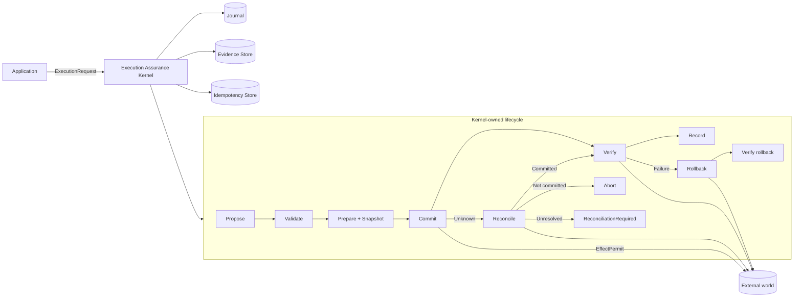
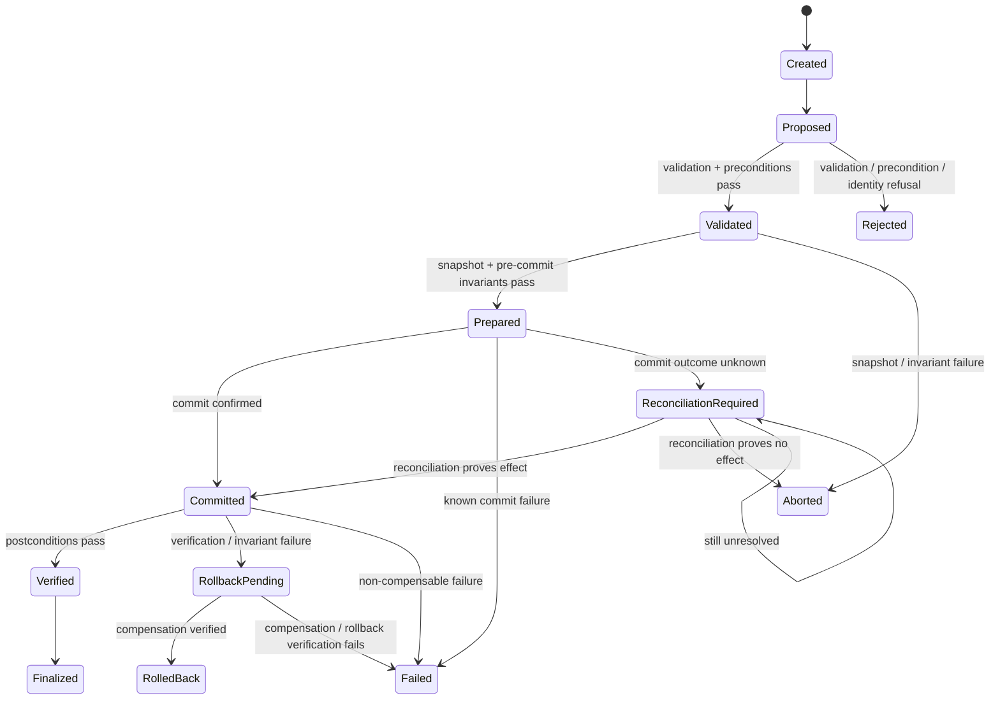

<div align="center">

# Execution Assurance Microkernel

**A compact Rust reference microkernel for making externally visible side effects verifiable, recoverable, and auditable.**

> **Commit is not success. Success is an established commit plus independently verified postconditions.**

[](https://github.com/SaridakisStamatisChristos/Execution-Assurance-Microkernel/actions/workflows/ci.yml)
[](LICENSE)
[](Cargo.toml)
[](Cargo.toml)
[](#scope-and-non-goals)

[Why it exists](#why-it-exists) · [Architecture](#architecture) · [Guarantees](#kernel-invariants-k1k7) · [Quick start](#quick-start) · [Recovery](#crash-recovery) · [Benchmarks](#benchmarks) · [License](#license)

</div>

---

## Why it exists

Software routinely treats a successful function return, database call, or HTTP response as proof that an operation succeeded. That assumption breaks at exactly the boundaries where reliability matters most:

- the remote side may apply an effect while the response is lost;
- a local process may crash between the external effect and its own durable bookkeeping;
- a commit may return successfully while the intended postcondition is absent;
- rollback may itself fail or only partially restore state;
- a retry after an unknown outcome may duplicate a real-world effect.

Execution Assurance Microkernel isolates that problem into one small, explicit lifecycle:

```text
PROPOSE -> VALIDATE -> PREPARE -> COMMIT -> VERIFY -> RECORD
                                      |         |
                                      |         +-- failure --> ROLLBACK -> VERIFY ROLLBACK
                                      +-- unknown --> RECONCILE (never blind retry)
```

The kernel does **not** decide what action should be taken. Application code proposes the action. The kernel decides whether it may cross the effect boundary, whether the effect can be established, whether the intended result actually exists, how an interrupted execution should recover, and what evidence remains afterward.

## At a glance

| Property | Implementation |
|---|---|
| Language | Rust 2021 |
| MSRV | Rust 1.89 |
| Unsafe Rust | Forbidden at crate level |
| Core success rule | established commit **and** verified postcondition |
| Unknown commit result | explicit reconciliation state; no blind retry |
| Rollback | snapshot-based, separately verified |
| Crash recovery | fsync-backed journal + recovery envelope |
| Execution identity | explicit execution ID + idempotency key |
| Durable local deduplication | atomic, fsync-backed claim files |
| Evidence | machine-readable execution record + SHA-256 seal |
| Secret handling | configurable + label-based diagnostic redaction |
| Fault testing | all 8 defined injection points + property/model tests |
| Reference actions | atomic file, SQLite, adversarial remote API |
| License | Apache-2.0 |

## Architecture



The effectful hooks `commit`, `rollback`, and `reconcile` require an `EffectPermit`. The type can be named by downstream `Action` implementations, but safe downstream code cannot construct it. The kernel therefore owns the normal effect boundary instead of relying only on convention.

## Execution state machine



`ReconciliationRequired` is deliberately nonterminal. It means the kernel refuses to guess whether the effect happened.

## Kernel invariants K1–K7

The project treats these as executable design constraints rather than documentation-only aspirations.

| ID | Invariant | Meaning |
|---|---|---|
| **K1** | `commit -> validation_passed` | no unchecked effect crosses the commit boundary |
| **K2** | `success -> commit_established && postconditions_verified` | a successful call is not enough |
| **K3** | `verification_failed -> outcome != success` | failed readback can never be reported as success |
| **K4** | `same_key -> commit_count <= 1` | duplicate idempotency keys do not create a second effect |
| **K5** | `terminal_state -> evidence_record_exists` | durable terminal state is written only after durable evidence |
| **K6** | `rollback_success -> rollback_postconditions_verified` | compensation must itself be proven |
| **K7** | `commit_unknown -> reconciliation_before_retry` | unknown outcomes are never blindly retried |

The implementation adds one further practical rule: duplicate **execution IDs** fail closed before the lifecycle begins.

## Core API

The public surface is intentionally small.

```rust
let result = Kernel::default().execute(action, &mut context)?;
```

For stable identity and deduplication:

```rust
use execution_assurance_microkernel::{
    ExecutionRequest, IdempotencyKey, Kernel,
};

let request = ExecutionRequest::new(action)
    .with_execution_id("job-42")
    .with_idempotency_key(IdempotencyKey::from("request-42"));

let result = kernel.execute_request(request, &mut context)?;
```

For restart recovery:

```rust
let result = kernel.recover("job-42", action, &mut context)?;
```

Application code implements `Action`; the kernel owns sequencing, durability boundaries, reconciliation, verification, evidence persistence, and terminal-state ordering.

## Quick start

### Requirements

- Rust **1.89 or newer**
- Cargo

### Build and validate

```bash
git clone https://github.com/SaridakisStamatisChristos/Execution-Assurance-Microkernel.git
cd Execution-Assurance-Microkernel

cargo fmt --all -- --check
cargo clippy --locked --all-targets --all-features -- -D warnings
cargo test --locked --all-targets --all-features
cargo test --locked --doc --all-features
RUSTDOCFLAGS="-D warnings" cargo doc --locked --no-deps
cargo bench --locked --no-run
```

### Run the reference actions

```bash
cargo run --example atomic_file
cargo run --example sqlite
cargo run --example unreliable_api
```

## Commit, verification, and compensation

### Commit is only an observation

`Action::commit` returns one of three semantic outcomes:

```text
Confirmed(output)
Failed(error)
Unknown(reason)
```

`Confirmed` means the commit boundary reported success. It does **not** automatically mean the execution is successful. The kernel still requires postcondition verification.

### Verification is independent

Verification should read the world back through a trustworthy observation path when practical:

- read the persisted file and verify its hash;
- query the database row and verify value/version;
- fetch the remote resource and compare expected state.

Only an established commit followed by successful verification can produce `ExecutionOutcome::Success`.

### Compensation is explicit

Actions declare either:

```text
Compensable
NonCompensable
```

A compensable action captures a pre-effect snapshot, performs rollback when needed, and independently verifies that rollback restored the intended state. A non-compensable action is never falsely reported as rolled back.

## Unknown outcomes and reconciliation

The most dangerous failure is often not a clear error, but uncertainty:

```text
send request
remote system applies effect
response disappears
client sees timeout
```

Retrying immediately can duplicate the effect. The kernel instead enters `ReconciliationRequired` and invokes action-specific readback logic.

| Reconciliation result | Kernel behavior |
|---|---|
| `Committed(output)` | continue to postcondition verification |
| `NotCommitted` | abort without re-running commit |
| `Unresolved(reason)` | remain recoverable and fail closed |

The kernel never calls `commit` twice for the same in-flight execution as a response to uncertainty.

## Crash recovery

The durable uncertainty boundary is intentionally explicit:

```text
WRITE PREPARED(snapshot + recovery envelope)
fsync

ATTEMPT EXTERNAL EFFECT

WRITE COMMITTED
fsync

VERIFY POSTCONDITION

WRITE VERIFIED
fsync

PERSIST SEALED EVIDENCE

WRITE TERMINAL STATE
fsync
```

A crash after the effect but before the local `Committed` marker therefore leaves the execution at durable `Prepared`. Recovery reconciles the external world instead of guessing or recommitting.

### Recovery table

| Last durable state | Recovery action |
|---|---|
| `Created` / `Proposed` / `Validated` | abort before commit |
| `Prepared` | reconcile before any retry decision |
| `ReconciliationRequired` | reconcile again; never recommit |
| `Committed` | re-establish/read back output, then verify or compensate |
| `RollbackPending` | verify whether compensation already completed; resume only if needed |
| `Verified` | finalize without repeating the effect |
| terminal state | no recovery action |

`Prepared` carries a `RecoveryEnvelope` with action identity, idempotency identity, start time, compensation policy, and the serialized rollback snapshot.

## Identity and idempotency

Two identities are intentionally separated:

- **Execution ID**: identity of this kernel execution.
- **Idempotency key**: identity of the logical effect/request.

Duplicate execution IDs fail closed. Duplicate idempotency keys do not silently cross the effect boundary again.

`InMemoryIdempotencyStore` is useful for tests and embedded use. `FileIdempotencyStore` uses atomically created claim files plus fsync so local claims survive process restart.

This is a **local execution guarantee**, not a distributed exactly-once protocol. Remote exactly-once behavior still depends on the external system exposing stable identity, readback, or native idempotency semantics.

## Evidence model

Every execution emits a machine-inspectable `ExecutionRecord` containing:

- execution, action, and idempotency identity;
- start/completion timestamps;
- state transitions;
- validation and precondition results;
- invariants before commit, after commit, and after rollback;
- commit disposition;
- reconciliation result;
- verification result;
- rollback result;
- recovery metadata;
- typed failure classification;
- final outcome;
- SHA-256 record seal.

### Terminal-state ordering

For K5, terminal durability is ordered as:

```text
construct terminal transition in memory
-> redact evidence
-> seal ExecutionRecord
-> persist evidence
-> append terminal journal state + fsync
-> return ExecutionResult
```

If evidence persistence fails, the journal remains at a recoverable nonterminal head such as `Verified` or `RollbackPending`.

### Redaction

`ConservativeRedactor` removes explicitly configured secret values plus values following common sensitive labels such as:

```text
password=
token=
secret=
api_key=
authorization=
```

Recovery snapshots live in the journal rather than the evidence record. They may still contain sensitive application state and should be protected accordingly.

## Failure taxonomy

The implementation avoids collapsing materially different failures into one generic error. Evidence distinguishes validation, precondition, snapshot, commit, unknown outcome, verification, invariant, rollback, compensation, reconciliation, recovery, evidence persistence, journal, execution identity, idempotency, and injected-fault failures.

That distinction matters because safe recovery depends on knowing **where uncertainty begins**.

## Fault injection and adversarial testing

The deterministic injector exposes all eight required lifecycle boundaries:

| Fault point | Expected safe interpretation |
|---|---|
| `BeforeSnapshot` | no effect; abort before commit |
| `AfterSnapshot` | no effect; abort before commit |
| `BeforeCommit` | prepared; reconcile before retry |
| `DuringCommit` | prepared; effect uncertain; reconcile |
| `AfterCommit` | prepared; effect may exist; reconcile |
| `BeforeVerify` | committed; verify or compensate |
| `DuringRollback` | rollback pending; resume/verify compensation |
| `AfterRollback` | rollback pending; verify whether rollback already completed |

The adversarial fake remote API additionally models:

- timeout before the effect is applied;
- effect applied but response lost;
- duplicate request;
- partial external write;
- conflicting remote state;
- unresolved commit outcome.

Property/model tests randomize lifecycle decisions and fault locations to check that safety invariants survive combinations beyond the hand-written cases.

## Reference actions

The repository intentionally contains **exactly three** reference actions.

| Example | What it demonstrates | Run |
|---|---|---|
| Atomic file replacement | snapshot, temp write, fsync, rename, hash verification, reconciliation, rollback | `cargo run --example atomic_file` |
| SQLite mutation | optimistic version precondition, persisted-state verification, reconciliation, rollback | `cargo run --example sqlite` |
| Unreliable remote API | timeout, duplicate request, lost response, partial write, uncertainty, reconciliation | `cargo run --example unreliable_api` |

The goal is depth of semantics, not integration count.

## Benchmarks

`benches/kernel.rs` measures three distinct costs:

```bash
cargo bench --locked --bench kernel
```

The harness emits explicit median/p95 samples in addition to Criterion's statistical report.

### Reference evidence

Reference run: GitHub Actions `ubuntu-24.04`, Rust stable 1.99.0, 2026-10-08.

| Path | Samples | Median | p95 |
|---|---:|---:|---:|
| core verified success | 512 | **7.013 µs** | **10.910 µs** |
| verification failure → verified rollback | 512 | **9.117 µs** | **15.729 µs** |
| durable verified success with fsync | 64 | **1.990 ms** | **2.522 ms** |

Criterion from the same run reported approximately `7.23–7.32 µs`, `9.45–9.65 µs`, and `2.29–2.42 ms` respectively.

[View the benchmark/validation run](https://github.com/SaridakisStamatisChristos/Execution-Assurance-Microkernel/actions/runs/37857640762)

These measurements are environment-specific observations, **not universal latency guarantees**. Shared-runner storage latency in particular can materially affect the fsync-backed path.

## Quality gates

Every CI run validates:

```text
rustfmt --check
Clippy -D warnings
all-target / all-feature tests
compile-fail doctests
rustdoc -D warnings
benchmark target compilation
Rust 1.89 MSRV
```

The workflow has read-only repository permissions.

## Repository layout

```text
.
├── src/
│   ├── action.rs          # Action contract, EffectPermit, compensation policy
│   ├── kernel.rs          # lifecycle orchestration and recovery execution
│   ├── state.rs           # explicit state machine
│   ├── invariant.rs       # preconditions and invariant phases
│   ├── journal.rs         # in-memory + fsync-backed execution journal
│   ├── recovery.rs        # recovery classification/directives
│   ├── idempotency.rs     # in-memory + durable local claims
│   ├── evidence.rs        # records, stores, hashing, redaction
│   ├── fault.rs           # deterministic fault injection
│   └── error.rs           # typed failure taxonomy
├── examples/
│   ├── atomic_file.rs
│   ├── sqlite.rs
│   └── unreliable_api.rs
├── tests/
│   ├── lifecycle.rs
│   ├── fault_injection.rs
│   ├── recovery.rs
│   ├── idempotency.rs
│   ├── model_based.rs
│   ├── evidence_integrity.rs
│   ├── assurance_boundaries.rs
│   └── durable_journal.rs
├── benches/kernel.rs
├── docs/
│   ├── SPEC.md
│   ├── STATE_MACHINE.md
│   └── FAILURE_MODEL.md
├── LICENSE
├── NOTICE
└── README.md
```

## Documentation

- [`docs/SPEC.md`](docs/SPEC.md) — formal execution contract and K1–K7 semantics.
- [`docs/STATE_MACHINE.md`](docs/STATE_MACHINE.md) — legal transitions and durable recovery interpretation.
- [`docs/FAILURE_MODEL.md`](docs/FAILURE_MODEL.md) — uncertainty, compensation, infrastructure failure, and fault semantics.

## Scope and non-goals

This repository is deliberately **not**:

- an agent framework or LLM runtime;
- a workflow builder or orchestration platform;
- a distributed transaction coordinator;
- a distributed consensus protocol;
- an authentication/authorization system;
- a message broker;
- a cloud platform;
- a vector database;
- a plugin system;
- a web UI.

Its claim stays narrow:

> **A minimal reference implementation showing how externally effectful software can distinguish attempted execution from verified execution.**

### What it does not claim

- **Distributed exactly-once execution.** Local durable claims do not replace remote idempotency or consensus.
- **Cryptographic authenticity/non-repudiation.** The SHA-256 record seal detects mutation relative to its recorded digest; it is not a signature or external trust anchor.
- **Encrypted persistence.** Journal snapshots may contain sensitive application data; storage protection is the caller's responsibility.
- **Universal rollback.** Some real-world effects are inherently non-compensable; the kernel models that explicitly.
- **Automatic application reconstruction.** Recovery reuses the matching `Action` implementation and caller-provided context; it does not serialize arbitrary Rust code or discover application resources.

The design prefers an explicit unresolved state over unsafe inference.

## Contributing

Changes should preserve the project's defining constraint: **small surface area, strong semantics**.

Before opening a pull request, run the same checks as CI:

```bash
cargo fmt --all -- --check
cargo clippy --locked --all-targets --all-features -- -D warnings
cargo test --locked --all-targets --all-features
cargo test --locked --doc --all-features
RUSTDOCFLAGS="-D warnings" cargo doc --locked --no-deps
cargo bench --locked --no-run
```

For changes to execution semantics, add deterministic failure coverage and update the formal docs in the same change.

## License

Copyright © 2026 **Stamatis-Christos Saridakis**.

Licensed under the **Apache License, Version 2.0**. See [`LICENSE`](LICENSE) and [`NOTICE`](NOTICE).

Apache-2.0 permits commercial and non-commercial use, modification, and redistribution subject to its terms, and includes an explicit patent license from contributors.
